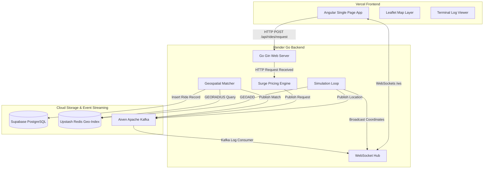
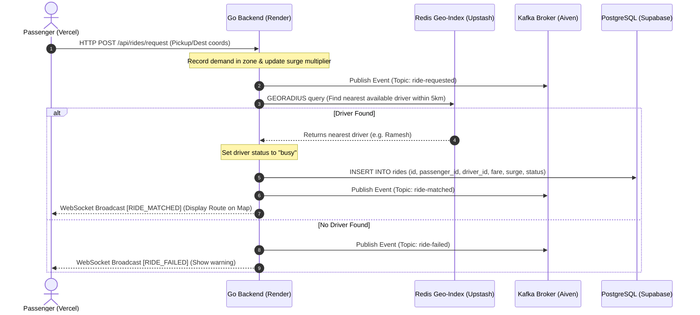

# Ride-Surge Architecture Guide

This document details the system design, real-time data flows, and architectural relationships of the Ride-Surge Live Engine.

---

## 🏗️ System Architecture Overview

The Ride-Surge Live Engine is built on a **reactive event-driven architecture**. It uses real-time data streaming to simulate driver movement, calculate surge multipliers based on spatial supply/demand, and perform geospatial ride matching.

### High-Level Topology

---

## 🔄 Real-Time Event Flows

Here is the exact step-by-step lifecycle of events during simulation and booking operations:

### 1. Driver Location updates (Every 1.5s / Simulation Speed)
1. The **Simulator** runs a loop modifying driver coordinates.
2. The new coordinate is sent to **Upstash Redis** using `GEOADD` to update the spatial index.
3. The coordinate update is published to **Aiven Kafka** on the `driver-location-updated` topic.
4. The Go **WebSocket Hub** broadcasts a `DRIVER_LOCATION` message to all connected Angular clients.
5. The **Leaflet Map** receives the update and smoothly glides (interpolates) the corresponding marker.

### 2. Ride Request & Dispatch Pipeline

---

## 🛠️ Technology Stack Breakdown

*   **Frontend**: Angular 18+, TypeScript, Leaflet Map API, HTML5 Canvas, and Vanilla CSS with Frosted-Glass overlays.
*   **Backend Server**: Go (Golang 1.25.0+), Gin Gonic HTTP Router, Gorilla WebSockets Hub.
*   **Message Broker**: Aiven Apache Kafka (GCP / Singapore) using SASL_SSL SCRAM-SHA-256 for secure event streaming.
*   **Geospatial Cache**: Upstash Redis Server utilizing Redis `GEO` operations for low-latency location indexing.
*   **Relational Database**: Supabase PostgreSQL with transaction pooling over port `6543`.
